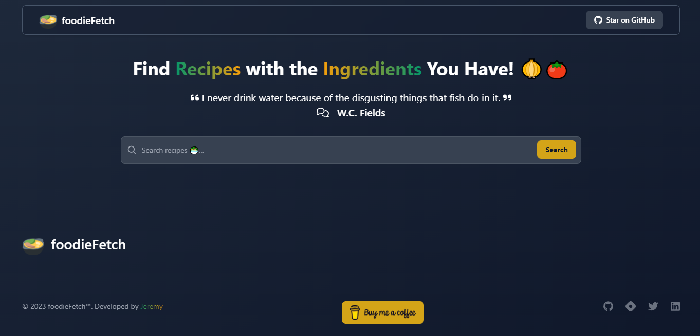
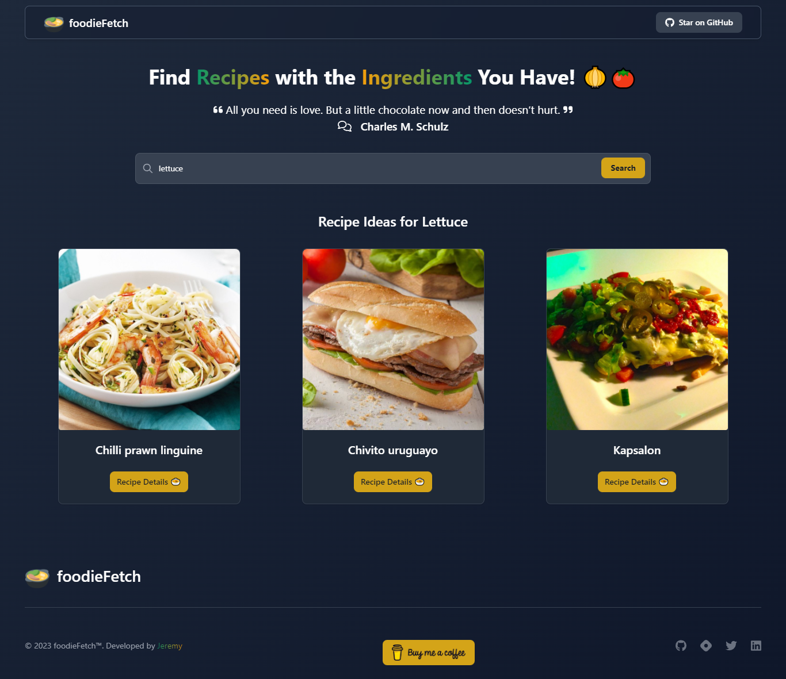
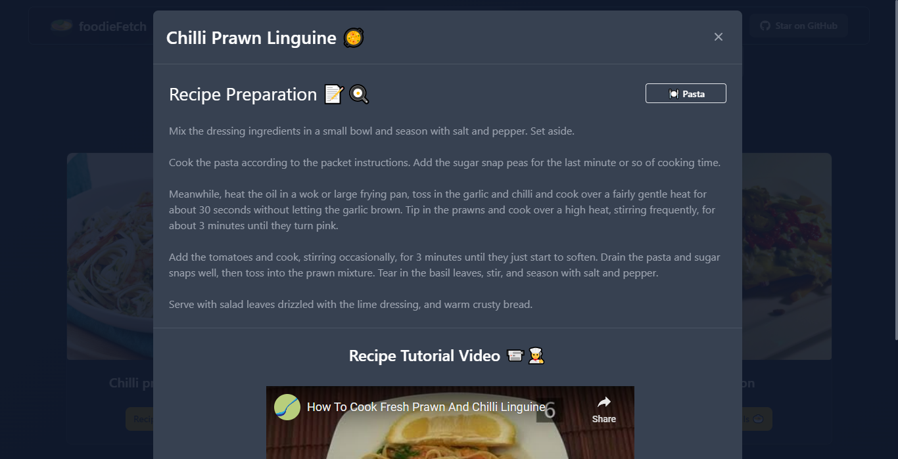

# 🍲 [foodieFetch](https://foodie-fetch.netlify.app)

foodieFetch is a simple food recipe app built with Vanilla JavaScript and Tailwind CSS. It uses the MealDB API to fetch recipes based on the ingredients you have on hand.



## How it works 🍜

When you first open foodieFetch at [foodie-fetch.netlify.app](https://fodie-fetch.netlify.app), you'll see a search bar where you can enter the ingredients you have. Clicking on the "Search" button will fetch recipe results from the API based on your search query.

You'll see a list of recipe results, each with a thumbnail image, recipe name, and a "`Recipe Details 🍲`" button. Clicking on the "Get Recipe" button for a recipe will display a popup with instructions and a video to watch below the instructions.





## Technologies used 🍴

foodieFetch is built using:

- JavaScript
- Tailwind CSS
- MealDB API

## Installation 🍽

- Clone the repository

```bash
git clone https://github.com/jeremy0x/foodie-fetch.git
```

- Install dependencies

```bash
npm install
```

- Run the development server

```bash
npm run watch
```

> `npm run watch` compiles Tailwind CSS and generates the `output.css` file. It also starts a development server on port 3000.

- Open [http://localhost:3000](http://localhost:3000) with your browser to see the result.

## Deployment

Build Command:

```bash
npm run build
```

> If deploying on Vercel, set the Output Directory to `.`.

## Credits 🧁

This app uses the MealDB API for recipe data. You can find more information about the API and how to use it at <https://www.themealdb.com/api.php>.

## Contributing 🥄

If you'd like to contribute to foodieFetch, please read the contributing guide. Contributions and bug reports are welcome!

If you like this project, please give it a star ⭐️
